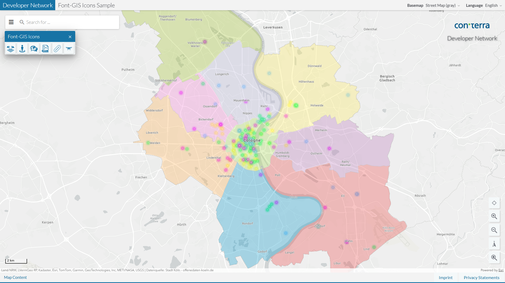

# Font-Awesome Icon Set
This bundle allows you to use the Font-GIS icons as themes extension in map.apps. All available icons can be seen in the [Font-GIS Icons Gallery](https://viglino.github.io/font-gis/?fg=earth).

Font-GIS Icons are licensed free, open source, and GPL friendly. For details, refer to the [Font-GIS license](src/main/js/bundles/dn_gisicons/LICENSE.md).

After installing the bundle to your map.apps installation and adding `dn_gisicons` it to your app you can use the new icons by adding e.g. “iconClass”:”fg-photogrammetry” to a tool definition inside the app.json. Or, if you have your own custom theme, you can replace all of the map.apps default icons.

### Sample App ###
https://demos.conterra.de/mapapps/resources/apps/downloads_fontgis

